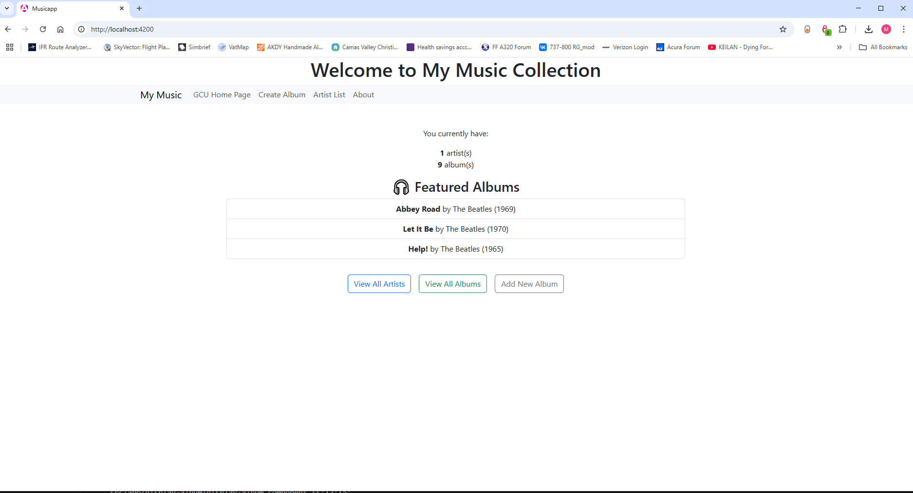
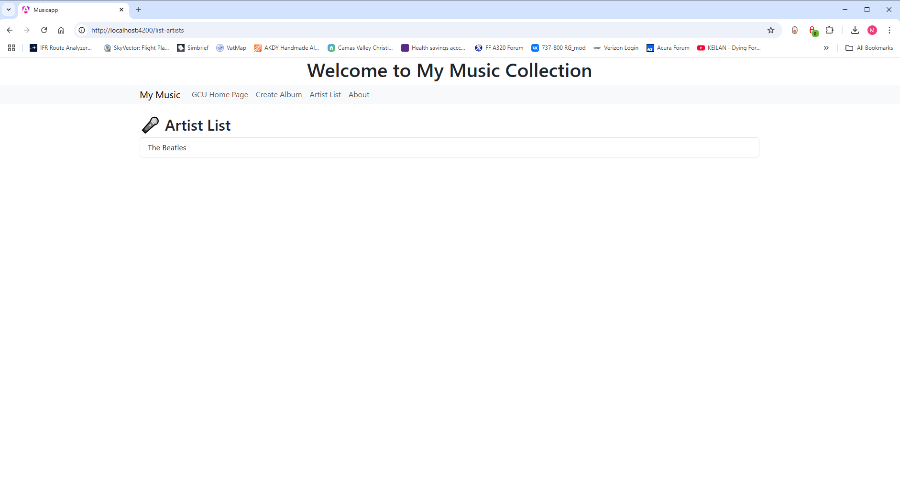
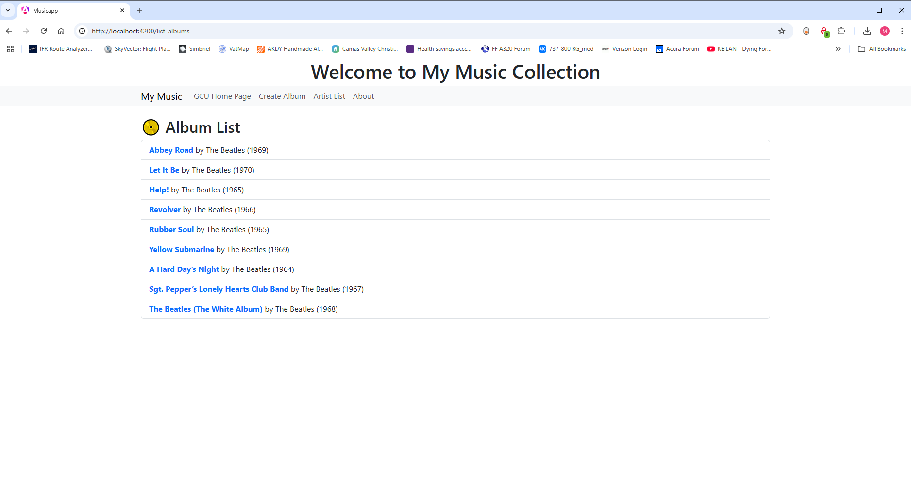
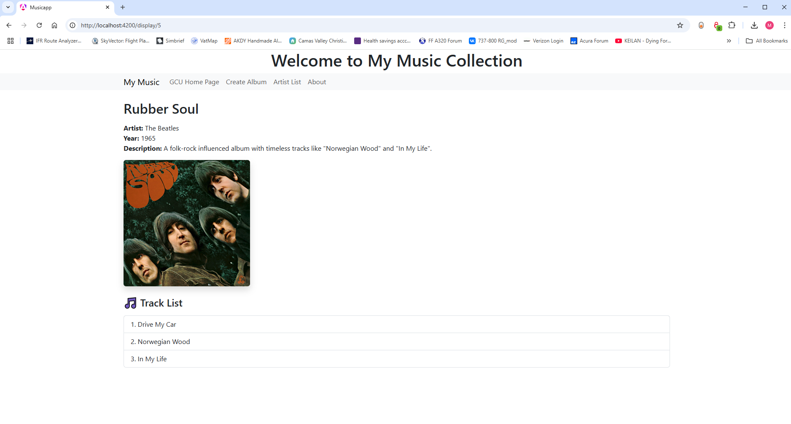
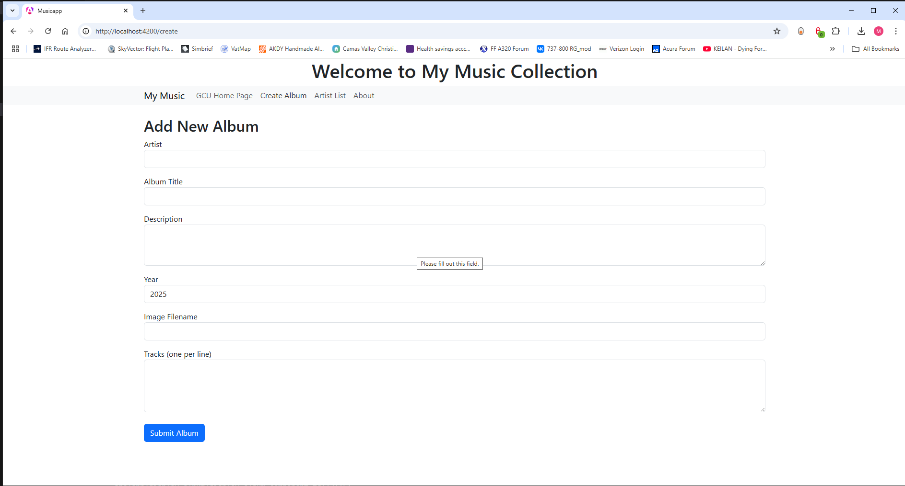

# CST-391 JavaScript Web Application Development  
**Activity 4: Angular Music App API Data**  
**Name:** Matt Kollar  
**Date:** March 24, 2025  

---

## 📷 Screenshots

### 🏠 Homepage
*Shows the landing page of the Angular Music App with a count of albums and artists. Three featured albums are displayed dynamically from the API.*  

### 👥 View All Artists
*Displays a list of all unique artists fetched from the backend MySQL database via the Express API.*  

### 💿 View All Albums
*Displays all albums from the database. Each item links to the album detail page and includes title, artist, and year.*  

### 📀 Album Details - Rubber Soul (with tracks)
*Shows the detailed view of the "Rubber Soul" album. Album info is displayed along with a partial (testing purposes) track list pulled from the backend.*  

### ➕ Add New Album
*Form to create a new album using Angular’s two-way binding and submits via a POST request to the backend API.*  

---

## 📝 Research Question

> **How does an Angular application maintain a logged-in state? How does it communicate this state to the server?**

Angular applications typically maintain a logged-in state using a combination of **JWT tokens** (JSON Web Tokens) and **browser storage** (e.g., `localStorage` or `sessionStorage`). After successful login, the server sends back a token which the Angular app stores locally.

For subsequent API requests, the Angular app attaches the token in the `Authorization` header (e.g., `Bearer <token>`), allowing the server to verify the user's identity without re-authenticating. This approach ensures stateless authentication and avoids storing sensitive session data on the server.
